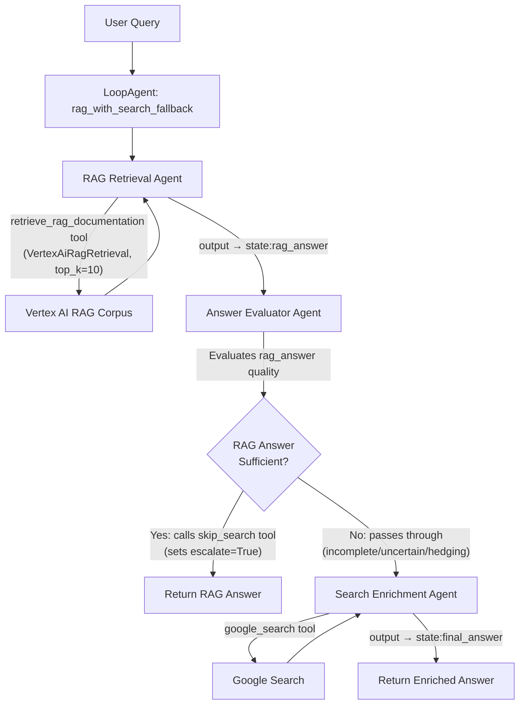

# Documentation Retrieval Agent

## Overview

This multi-agent system answers questions about documents stored in Vertex AI RAG Engine. Built using a **LoopAgent** with 3 specialized subagents, it combines RAG retrieval, quality evaluation, and conditional Google Search enrichment to provide accurate, cited responses.

**Agent Workflow:**
1. **RAG Retrieval Agent** - Queries Vertex AI RAG corpus for relevant documentation
2. **Answer Evaluator Agent** - Assesses quality and determines if search enrichment is needed
3. **Search Enrichment Agent** - Conditionally adds Google Search results when RAG alone is insufficient

The system leverages Retrieval-Augmented Generation (RAG) with the Vertex AI RAG Engine to fetch documentation snippets and code references, then synthesizes them with an LLM (Gemini) to provide informative answers with citations.

**Built by:** [goodrules](https://github.com/goodrules)
**Inspired by:** [Google ADK RAG Sample](https://github.com/google/adk-samples/tree/main/python/agents/RAG)


This diagram outlines the multi-agent workflow. User queries are processed through a LoopAgent that orchestrates three specialized subagents:

1. **RAG Retrieval Agent** uses the `VertexAiRagRetrieval` tool to fetch relevant information from the configured Vertex RAG Engine corpus
2. **Answer Evaluator Agent** assesses the quality of the RAG results and determines if additional enrichment is needed
3. **Search Enrichment Agent** (conditional) uses the `google_search` tool to augment responses when RAG alone is insufficient

The final answer includes citations pointing back to source documentation URLs.

## Agent Details
| Attribute         | Details                                                                                                                                                                                             |
| :---------------- | :-------------------------------------------------------------------------------------------------------------------------------------------------------------------------------------------------- |
| **Interaction Type** | Conversational                                                                                                                                                                                      |
| **Complexity**    | Intermediate 
| **Agent Type**    | Multi-Agent System (LoopAgent with 3 subagents)                                                                                                                                                                                        |
| **Components**    | Tools, RAG, Evaluation                                                                                                                                                                               |
| **Vertical**      | Horizontal                                                                                                                                                                               |
### Agent Architecture




### Key Features

*   **Multi-Agent Architecture:** Three specialized agents working in sequence for optimal retrieval and quality
*   **Intelligent Fallback:** Automatically enriches with Google Search when RAG is insufficient
*   **Quality Evaluation:** Built-in assessment layer ensures response completeness
*   **Retrieval-Augmented Generation (RAG):** Leverages [Vertex AI RAG
    Engine](https://cloud.google.com/vertex-ai/generative-ai/docs/rag-overview)
    to fetch relevant documentation
*   **Citation Support:** Provides accurate citations for the retrieved content,
    formatted as URLs
*   **Clear Instructions:** Adheres to strict guidelines for providing factual
    answers and proper citations

## Setup and Installation Instructions
### Prerequisites

*   **Google Cloud Account:** You need a Google Cloud account.
*   **Python 3.10+:** Ensure you have Python 3.10 or a later version installed.
*   **uv:** For dependency management and packaging. Please follow the instructions on the official [uv website](https://docs.astral.sh/uv/) for installation.

    ```bash
    curl -LsSf https://astral.sh/uv/install.sh | sh
    ```

*   **Git:** Ensure you have git installed.

### Project Setup

1.  **Clone the Repository:**

    ```bash
    git clone https://github.com/goodrules/adk-scratchpad.git
    cd adk-scratchpad/agents/rag_agent
    ```

2.  **Install Dependencies:**

    ```bash
    uv sync
    ```

    This command reads the `pyproject.toml` file and installs all the necessary dependencies into a virtual environment.

3.  **Set up Environment Variables:**
    Rename the file ".env.example" to ".env" 
    Follow the steps in the file to set up the environment variables.

4. **Setup Corpus:**
    If you have an existing corpus in Vertex AI RAG Engine, please set corpus information in your .env file. For example: RAG_CORPUS='projects/123/locations/us-central1/ragCorpora/456'.

    If you don't have a corpus setup yet, please follow "How to upload my file to my RAG corpus" section. The `prepare_corpus_and_data.py` script will automatically create a corpus (if needed) and update the `RAG_CORPUS` variable in your `.env` file with the resource name of the created or retrieved corpus.

#### How to upload my file to my RAG corpus

The `rag/shared_libraries/prepare_corpus_and_data.py` script helps you set up a RAG corpus and upload an initial document. By default, it downloads Alphabet's 2024 10-K PDF and uploads it to a new corpus.

1.  **Authenticate with your Google Cloud account:**
    ```bash
    gcloud auth application-default login
    ```

2.  **Set up environment variables in your `.env` file:**
    Ensure your `.env` file (copied from `.env.example`) has the following variables set:
    ```
    GOOGLE_CLOUD_PROJECT=your-project-id
    GOOGLE_CLOUD_LOCATION=your-location  # e.g., us-central1
    ```

3.  **Configure and run the preparation script:**
    *   **To use the default behavior (upload Alphabet's 10K PDF):**
        Simply run the script:
        ```bash
        uv run python rag/shared_libraries/prepare_corpus_and_data.py
        ```
        This will create a corpus named `Alphabet_10K_2024_corpus` (if it doesn't exist) and upload the PDF `goog-10-k-2024.pdf` downloaded from the URL specified in the script.

    *   **To upload a different PDF from a URL:**
        a. Open the `rag/shared_libraries/prepare_corpus_and_data.py` file.
        b. Modify the following variables at the top of the script:
           ```python
           # --- Please fill in your configurations ---
           # ... project and location are read from .env ...
           CORPUS_DISPLAY_NAME = "Your_Corpus_Name"  # Change as needed
           CORPUS_DESCRIPTION = "Description of your corpus" # Change as needed
           PDF_URL = "https://path/to/your/document.pdf"  # URL to YOUR PDF document
           PDF_FILENAME = "your_document.pdf"  # Name for the file in the corpus
           # --- Start of the script ---
           ```
        c. Run the script:
           ```bash
           uv run python rag/shared_libraries/prepare_corpus_and_data.py
           ```

    *   **To upload a local PDF file:**
        a. Open the `rag/shared_libraries/prepare_corpus_and_data.py` file.
        b. Modify the `CORPUS_DISPLAY_NAME` and `CORPUS_DESCRIPTION` variables as needed (see above).
        c. Modify the `main()` function at the bottom of the script to directly call `upload_pdf_to_corpus` with your local file details:
           ```python
           def main():
             initialize_vertex_ai()
             corpus = create_or_get_corpus() # Uses CORPUS_DISPLAY_NAME & CORPUS_DESCRIPTION

             # Upload your local PDF to the corpus
             local_file_path = "/path/to/your/local/file.pdf" # Set the correct path
             display_name = "Your_File_Name.pdf" # Set the desired display name
             description = "Description of your file" # Set the description

             # Ensure the file exists before uploading
             if os.path.exists(local_file_path):
                 upload_pdf_to_corpus(
                     corpus_name=corpus.name,
                     pdf_path=local_file_path,
                     display_name=display_name,
                     description=description
                 )
             else:
                 print(f"Error: Local file not found at {local_file_path}")

             # List all files in the corpus
             list_corpus_files(corpus_name=corpus.name)
           ```
        d. Run the script:
           ```bash
           uv run python rag/shared_libraries/prepare_corpus_and_data.py
           ```

More details about managing data in Vertex RAG Engine can be found in the
[official documentation page](https://cloud.google.com/vertex-ai/generative-ai/docs/rag-quickstart).

## Running the Agent
You can run the agent using the ADK command in your terminal.
from the root project directory:

1.  Run agent in CLI:

    ```bash
    adk run rag
    ```

2.  Run agent with ADK Web UI:
    ```bash
    adk web
    ```
    Select the RAG from the dropdown


## Example Interactions
Here are examples of how users might interact with the agent:

**Example 1: Document Information Retrieval**

User: What are the key business segments mentioned in Alphabet's 2024 10-K report?

Agent: According to Alphabet's 2024 10-K report, the key business segments are:
1. Google Services (including Google Search, YouTube, Google Maps, Play Store)
2. Google Cloud (offering cloud computing services, data analytics, and AI solutions)
3. Other Bets (including Waymo for autonomous driving technology)
[Source: goog-10-k-2024.pdf]

**Example 2: RAG Sufficient - No Search Needed**

User: What is Alphabet's stock ticker symbol?

Agent: Alphabet's stock ticker symbol is GOOGL (Class A shares) and GOOG (Class C shares).
[Source: goog-10-k-2024.pdf]

*Note: The Answer Evaluator Agent determined RAG provided sufficient information, so Google Search was skipped.*

**Example 3: RAG Insufficient - Search Enrichment**

User: How does Alphabet's 2024 revenue compare to Microsoft's?

Agent: According to Alphabet's 2024 10-K, their total revenue was $307.4 billion. [Source: goog-10-k-2024.pdf]

Microsoft's fiscal 2024 revenue was $245.1 billion according to recent financial reports. [Source: Google Search - Microsoft Investor Relations]

Alphabet's revenue exceeded Microsoft's by approximately $62.3 billion in 2024.

*Note: The Answer Evaluator Agent determined RAG data was insufficient for comparison, triggering the Search Enrichment Agent to supplement with Microsoft's data.*

## Customization

### Customize Agent
You can customize the multi-agent system by modifying individual subagents:
- **Subagent Configuration:** Each subagent can be customized in `rag/subagents/` (rag_retrieval, answer_evaluator, search_enrichment)
- **Prompts:** Customize agent instructions in `rag/prompts.py`
- **Workflow Orchestration:** Modify the agent sequence and iteration limits in `rag/agent.py`
- **Tools:** Add more tools to suit your needs (e.g., additional search sources, document processors)

### Customize Vertex RAG Engine
You can read more about [official Vertex RAG Engine documentation](https://cloud.google.com/vertex-ai/generative-ai/docs/rag-quickstart) for more details on customizing corpora and data.


### Plug-in other retrieval sources
You can replace or augment the `VertexAiRagRetrieval` tool with other retrieval sources like Vertex AI Search or custom retrieval mechanisms.


## Troubleshooting

### Quota Exceeded Errors

When running the `prepare_corpus_and_data.py` script, you may encounter an error related to API quotas, such as:

```
Error uploading file ...: 429 Quota exceeded for aiplatform.googleapis.com/online_prediction_requests_per_base_model with base model: textembedding-gecko.
```

This is especially common for new Google Cloud projects that have lower default quotas.

**Solution:**

You will need to request a quota increase for the model you are using.

1.  Navigate to the **Quotas** page in the Google Cloud Console: [https://console.cloud.google.com/iam-admin/quotas](https://console.cloud.google.com/iam-admin/quotas)
2.  Follow the instructions in the official documentation to request a quota increase: [https://cloud.google.com/vertex-ai/docs/quotas#request_a_quota_increase](https://cloud.google.com/vertex-ai/docs/quotas#request_a_quota_increase)


## Disclaimer

This agent sample is provided for illustrative purposes only and is not intended for production use. It serves as a basic example of an agent and a foundational starting point for individuals or teams to develop their own agents.

This sample has not been rigorously tested, may contain bugs or limitations, and does not include features or optimizations typically required for a production environment (e.g., robust error handling, security measures, scalability, performance considerations, comprehensive logging, or advanced configuration options).

Users are solely responsible for any further development, testing, security hardening, and deployment of agents based on this sample. We recommend thorough review, testing, and the implementation of appropriate safeguards before using any derived agent in a live or critical system.